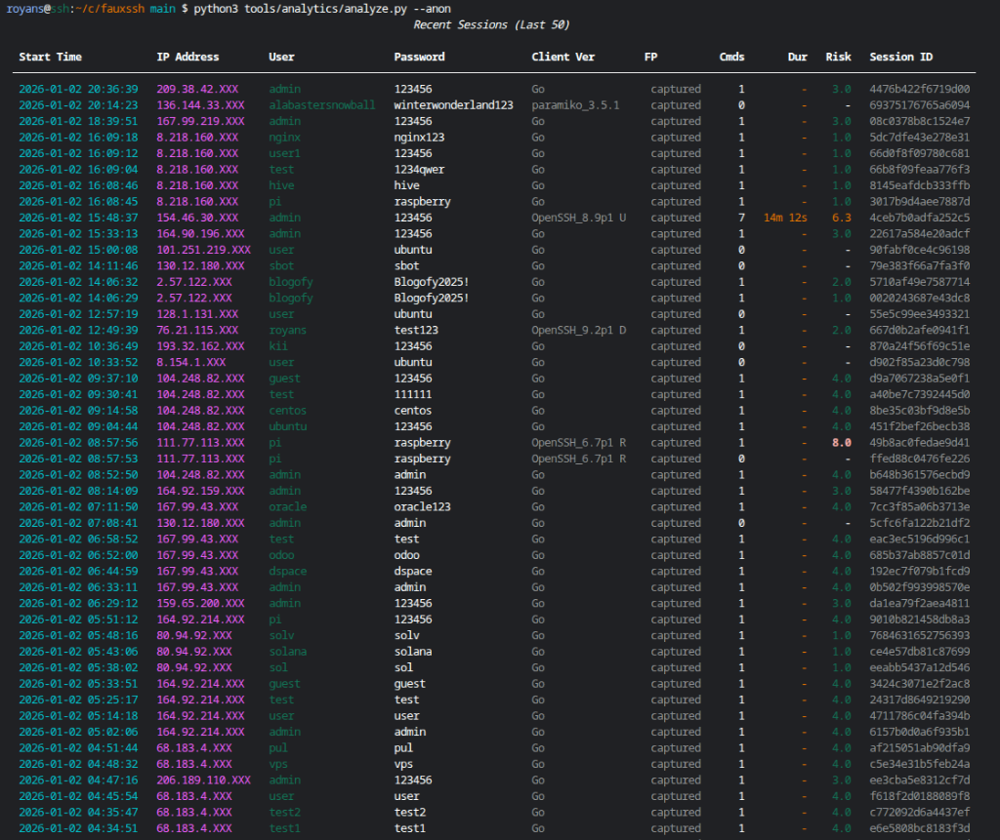
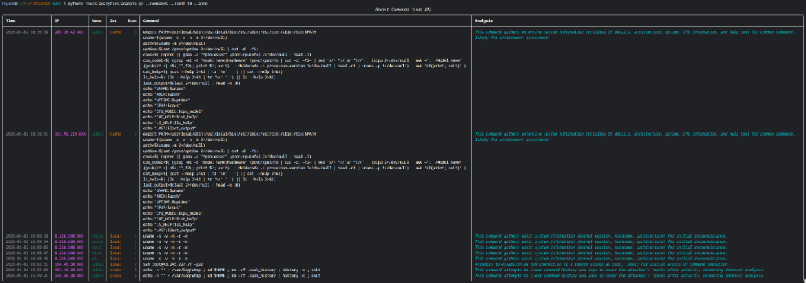
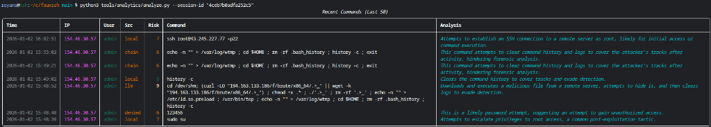

# FauxSSH


**A high-interaction SSH honeypot powered by Google Gemini.**

FauxSSH deceptively emulates a realistic Linux server, engaging attackers in long, hallucinated sessions while recording every keystroke, file upload, and command output for threat intelligence analysis.

## Key Features

- **🧠 LLM-Powered Realism**: Uses Google Gemini to dynamically generate file contents (`cat`, `ls`), command responses (`ps aux`, `docker ps`), and error messages.
- **🕵️‍♂️ Behavioral Analysis**: Automatically analyzes attacker commands for risk, intent, and TTPs (Tactics, Techniques, and Procedures).
- **🔒 Safe & Isolated**: All uploaded files are sandboxed. The "filesystem" is virtual and strictly isolated from the host.
- **🚨 Real-Time Alerting**: Stream high-risk sessions live to Discord or Slack.
- **📊 Built-in Analytics**: CLI tools to visualize sessions, inspect malware, and correlate threat actors.

## Quick Start

### 1. Manual Run (Developer Mode)
Great for testing quickly without background services.

```bash
# 1. Clone & Install
git clone https://github.com/royans/fauxssh.git
cd fauxssh
pip install -r requirements.txt

# 2. Configure
cp .env.example .env
nano .env # Add your GOOGLE_API_KEY

# 3. Run
python3 -m ssh_honeypot.server
```

### 2. Production Startup
Use the included script for robust background execution and logging.

```bash
./tools/startup.sh
```

## Analytics Examples

FauxSSH includes powerful CLI tools to visualize captured data. See [Logging & Analytics](docs/LOGGING.md) for details.

### Recent Sessions
`python3 tools/analytics/analyze.py --sessions --anon`


### Command History
`python3 tools/analytics/analyze.py --commands`


### Session Verification (Replay)
`python3 tools/analytics/analyze.py --session-id <ID>`


### Filesystem Forensics
Inspect and manage attacker uploads in real-time.
`python3 tools/analytics/fs_inspector.py --tree`
`python3 tools/analytics/fs_inspector.py --ip <IP> --cat /path/to/malware.sh`
`python3 tools/analytics/fs_inspector.py --ip <IP> --delete`


## Documentation

*   [**Configuration Guide**](docs/CONFIGURATION.md): `.env` settings, port binding, and model tuning.
*   [**Deployment Guide**](docs/DEPLOYMENT.md): Production startup, cron jobs, and port forwarding (Port 22).
*   [**Alerting Setup**](docs/ALERTING.md): Configure Discord/Slack webhooks and keyword triggers.
*   [**Logging & Data**](docs/LOGGING.md): understanding the database schema, JSON logs, and uploaded files.
*   [**Changelog**](docs/CHANGELOG.md): Version history and recent features.
*   [**Educational Use**](docs/EDUCATIONAL.md): A guide for researchers and students.

## Security Warning

> [!WARNING]
> This software is designed to be attacked. While FauxSSH is built with isolation in mind, **never run honeypots on critical production infrastructure** or networks containing sensitive data. Always use a dedicated VPS or isolated VLAN.

## Disclaimer

This tool is for educational and defensive research purposes only. The authors are not responsible for any misuse or damage caused by this software.
