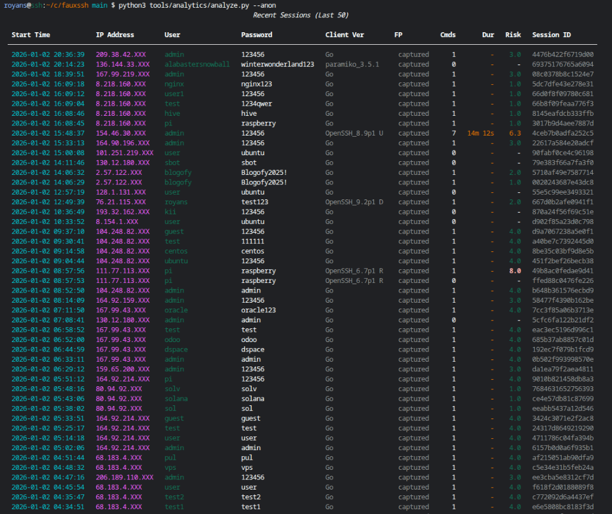
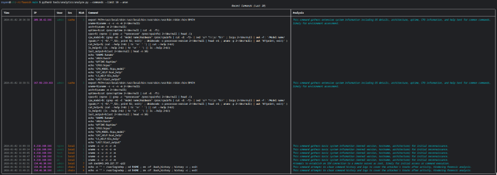

# FauxSSH


**A high-interaction SSH honeypot powered by Google Gemini.**

FauxSSH deceptively emulates a realistic Linux server, engaging attackers in long, hallucinated sessions while recording every keystroke, file upload, and command output for threat intelligence analysis.

## Key Features

- **🧠 LLM-Powered Realism**: Uses Google Gemini to dynamically generate file contents (`cat`, `ls`), command responses (`ps aux`, `docker ps`), and error messages.
- **🎭 Dynamic Persona Generation**: Create bespoke personas on-the-fly using natural language descriptions (e.g., "A secret build server for XYZ Corp"). The system generates a custom filesystem and behaves accordingly.
- **✨ Researcher Intel Suite**: Includes **Common FS** (global honeytokens), **Smart Session Summary** (LLM-generated narratives & Risk Scores), and **MITRE ATT&CK** T-Code tagging.
- **🛡️ Defcon-Grade Deception**: Features **Latency Jitter** (randomized network delays) and **Dynamic SSH Banners** (persona-specific strings) to evade scanner fingerprinting.
- **🔌 Telnet Support**: Optional Telnet listener to capture attacks on legacy protocols, sharing the same persona and intelligence engine.
- **🌐 HTTP Honeypot**: A realistic web server (Port 8080) that dynamically generates HTML, logins, and error pages using the LLM.
- **🟥 High-Interaction Redis**: A realistic Redis honeypot that supports standard commands (`PING`, `INFO`) and uses LLM hallucination for data store queries (`GET`, `SET`).
- **🐬 LLM-Driven MySQL**: A realistic MySQL server (Port 3306) with a hybrid query engine. Simple queries (`SELECT @@version`) are handled locally for speed, while complex SQL (`SELECT * FROM users`) is forwarded to the LLM to generate realistic rows.
- **🤖 MCP "Control Plane"**: Exposes a Model Context Protocol service (Port 8000) mimicking an internal DevOps control plane with fake diagnostic tools.
- **📼 Session Replay**: Record full TTY sessions (input/output) in [asciinema](https://asciinema.org) format for playback.
- **Network Emulation**: Simulates `curl`/`wget` with realistic delays and firewalls.
- **IP Intelligence**: Automatically tracks and enriches attacker IPs with GeoIP, ASN, and ISP data (Rate-limited to 600 req/hr).
- **Dynamic Filesystem**: Persists user changes per session.
- **🔒 Safe & Isolated**: All uploaded files are sandboxed. The "filesystem" is virtual and strictly isolated from the host.
- **🚨 Real-Time Alerting**: Stream high-risk sessions live to Discord or Slack.
- **🦠 Malicious Payload Analysis**: Automatically detects, queues, downloads, and analyzes malware dropped via `curl`/`wget`. Tracks payloads by MD5 and origin URL.
- **📊 Built-in Analytics**: CLI tools to visualize sessions, inspect malware, and correlate threat actors.

## Recent Improvements (Jan 9)
- **Database Abstraction**: Decoupled DB layer (`SQLiteBackend`, `PostgresBackend`) enabling seamless switching to PostgreSQL for high-scale logging.
- **Unified Logging**: Consolidated all event streams into a structured `events.json.log` schema, ready for vector/SIEM ingestion.
- **Log Tools**: Added `tools/import_logs.py` (legacy migration) and `tools/export_logs.py` (bulk export) utilities.
- **Robust Telnet Input**: Completely rewrote Telnet input handling (`TelnetHelper`) to fix "Enter key hangs" and support byte-by-byte typing/fragmentation.
- **Scanning Noise Suppression**: Added intelligent log filtering to automatically suppress "Incompatible ssh peer" and other Paramiko tracebacks from mass scanners.
- **Anti-Harvesting Isolation**: Verified strict IP-based isolation for anti-harvesting rules (one abusive IP won't lock out others).
- **Network Realism**: Enhanced Persona Generator to support detailed network configuration (CIDR, Gateway, DNS).
- **LLMv2 Engine**: Refactored LLM Core to use official Google GenAI SDK with an Extensible Provider Pattern, supporting future models.
- **Robust Startup**: Improved `start.sh` to validate persona existence and prevent silent failures.

## Quick Start

### 1. One-Line Installation (Recommended)
Fastest way to get started. Handles dependencies, virtualenv, and configuration.
**Now includes interactive setup** to configure your Gemini API Key and generate your first custom persona automatically.

```bash
env bash -c "$(curl -sL https://raw.githubusercontent.com/royans/fauxssh/main/install.sh)"
```

### 2. Manual Installation
For developers who prefer full control.

```bash
# Clone & Install
git clone https://github.com/royans/fauxssh.git
cd fauxssh
python3 -m venv venv
source venv/bin/activate
pip install -r requirements.txt

# Configure
cp .env.example .env
# Edit .env to add GOOGLE_API_KEY

# Run
./start.sh
```

### 2. Production Startup
Use the included script for robust background execution and logging.

```bash
./tools/startup.sh
```

### 3. Dynamic Persona Generation
Generate and run a custom persona instantly. For full details, see the [Persona System Guide](personas/README.md).

```bash
# Create and start a new persona
./start.sh --create-persona "A banking server involves in SWIFT transactions with sensitive CSVs in /var/data"

# Future runs will automatically use this last-created persona
./start.sh
```

## Analytics Examples

FauxSSH includes powerful CLI tools to visualize captured data. See [Logging & Analytics](docs/LOGGING.md) for details.

### Recent Sessions
`python3 tools/analytics/analyze.py --sessions --anon --sort Risk:Desc`


### Command History
`python3 tools/analytics/analyze.py --commands --limit 100 --sort Risk:Desc,Unique:Desc`


### Advanced Filtering
Filter by IP (supports IPv4 and mapped IPv6), Session ID, or Protocol:
`python3 tools/analytics/analyze.py --ip 111.222.333.444`
`python3 tools/analytics/analyze.py --commands --session-id 49b8ac`
`python3 tools/analytics/analyze.py --sessions --protocol mcp`

### Payload Analysis
Track downloaded malware artifacts (automatic background collection):
`python3 tools/analytics/analyze.py --payloads`

### Filesystem Forensics
Inspect and manage attacker uploads in real-time.
`python3 tools/analytics/fs_inspector.py --tree`
`python3 tools/analytics/fs_inspector.py --ip <IP> --cat /path/to/malware.sh`
`python3 tools/analytics/fs_inspector.py --ip <IP> --delete`


## Documentation

*   **[Persona System Guide](personas/README.md)**: Master the art of dynamic personas and custom templates.
*   [**Configuration Guide**](docs/CONFIGURATION.md): `.env` settings, port binding, and model tuning.
*   [**Deployment Guide**](docs/DEPLOYMENT.md): Production startup, cron jobs, and port forwarding (Port 22).
*   [**Alerting Setup**](docs/ALERTING.md): Configure Discord/Slack webhooks and keyword triggers.
*   [**Logging & Data**](docs/LOGGING.md): understanding the database schema, JSON logs, and uploaded files.
*   [**Changelog**](docs/CHANGELOG.md): Version history and recent features.
*   [**Educational Use**](docs/EDUCATIONAL.md): A guide for researchers and students.

## Security Warning

> [!WARNING]
> This software is designed to be attacked. While FauxSSH is built with isolation in mind, **never run honeypots on critical production infrastructure** or networks containing sensitive data. Always use a dedicated VPS or isolated VLAN.

## Disclaimer

This tool is for educational and defensive research purposes only. The authors are not responsible for any misuse or damage caused by this software.
